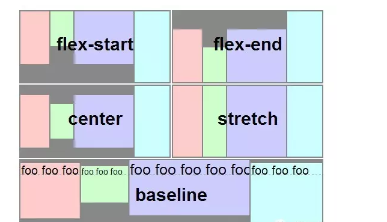
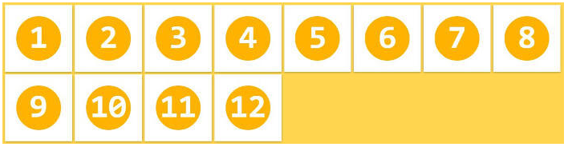
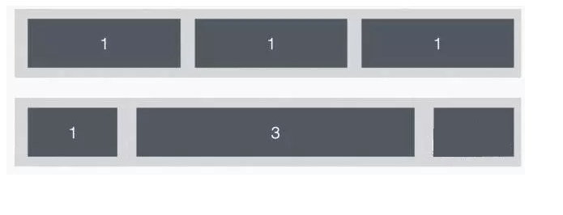
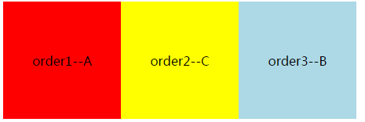
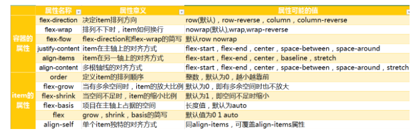

# 一、弹性布局介绍

​	在以往做过的几个项目中，我曾多次使用flex布局，对于这个css3的新属性简直是爱的不行，今天给大家简单的介绍一下flex布局。本人阅历见识以及知识储备尚浅，其中若有错误和不足之处还望各位大佬能指出。

​	网页布局（layout）是 CSS 的一个重点应用。在传统布局基于盒状模型，依赖 `display`属性 +`position`属性+`float`属性。这些对于那些特殊的布局非常不方便，比如垂直居中。

​	2009年，W3C 提出了一种新的方案----Flex 布局，可以简便、完整、响应式地实现各种页面布局。


从上图可以看出，前主流的浏览器都支持flex布局，


# 二、基础篇

## 01、什么是Flex布局？

​	Flex 是 Flexible Box 的缩写，意为"弹性布局"，用来为盒状模型提供最大的灵活性。旨在通过弹性的方式来对齐和分布容器中内容的空间，使其能适应不同屏幕，为盒装模型提供最大的灵活性任。何一个容器都可以指定为 Flex 布局。

​      FlexBox布局**更多的用到**移动端**，PC端除了**盒子模型**布局，也支持**FlexBox**布局 , FlexBox布局将会是成为**未来开发的主流技术，将在移动端体现的最明显。

​	采用 Flex 布局的元素，称为 Flex 容器（flex container），简称"容器"。它的所有子元素自动成为容器成员，称为 Flex 项目（flex item），简称"项目"。

​	html部分：

```
<div class="box">
       <div class="box1"></div>
 </div>
```

​	css部分：

```
 .box{
     display: flex;
   }
```

上面就是一个最简单的flex布局，任何元素都能设置flex布局。行内元素写作`display:inline-flex`。

注意，设为 Flex 布局以后，子元素的`float`、`clear `和 `vertical-align`属性将失效。


- ​

## 02、Flex布局的思想

主轴、侧轴


​      容器默认存在两根轴：**水平的主轴（main axis）**和**垂直的交叉轴（cross axis）**。主轴的开始位置（与边框的交叉点）叫做main start，结束位置叫做main end；交叉轴的开始位置叫做cross start，结束位置叫做cross end。

​    项目默认沿主轴排列，单个项目占据的主轴空间叫做main size，占据的交叉轴空间叫做cross size。

## 03 、容器的属性

常用的有6个属性

- flex-direction
- flex-wrap
- flex-flow
- justify-content
- align-items
- align-content

##### 1.flexDirection

`row | row-reverse | column | column-reverse`

  **该属性：规定了主轴的方向（父容器中的排列方向）**。

     row：主轴为水平方向，起点在左端。

     row-reverse：主轴为水平方向，起点在右端。

    column(默认值)：主轴为垂直方向，起点在上沿。

    column-reverse：主轴为垂直方向，起点在下沿。

    column-reverse：主轴为垂直方向，起点在下沿。


##### 2.justifyContent

**`flex-start | flex-end | center | space-between | space-around`**

**规定：子item在主轴方向的对齐方式**

      flex-start(默认值)：伸缩项目向一行的起始位置靠齐。

      flex-end：伸缩项目向一行的结束位置靠齐。

      center：伸缩项目向一行的中间位置靠齐。

      space-between：两端对齐，项目之间的间隔都相等。

      space-around：伸缩项目会平均地分布在行里，两端保留一半的空间。

  **下图灰色为背景,主轴方向为水平，侧轴方向为垂直**：


##### 3.alignItems

`flex-start | flex-end | center | baseline | stretch`

**规定：子item在侧轴方向的对齐方式**

      flex-start：交叉轴的起点对齐。

      flex-end：交叉轴的终点对齐 。

      center：交叉轴的中点对齐。

      baseline：项目的第一行文字的基线对齐。

      stretch（默认值）：如果项目未设置高度或设为auto，将占满整个容器的高度。

**下图灰色为背景，主轴方向是水平，侧轴方向是垂直**




##### 4.flexWrap

**`nowrap | wrap | wrap-reverse`**

默认情况下，项目都排在一条线（又称"轴线"）上。flex-wrap属性定义，如果一条轴线排不下，如何换行。


nowrap(默认值)：不换行。

![0]flex/007.png)

wrap：换行，第一行在上方。



wrap-reverse：换行，第一行在下方。（和wrap相反）


## 04、元素的属性

##### 1.flex

flex是 “flex-grow”、“flex-shrink”和“flex-basis”[三个属性的缩写](http://www.runoob.com/w3cnote/flex-grammar.html) , 参数一：定义项目的放大比例；参数二：定义了项目的缩小比例；参数三：定义了在分配多余空间之前，项目占据的主轴空间。其中第二个和第三个参数（flex-shrink、flex-basis）是可选参数。

flex默认值为“0  1  auto ”。



权重分别：1，1，1 和1、3、1

##### 2.align-self

align-self属性允许单个item有与其他item不一样的对齐方式

```
align-self: auto | flex-start | flex-end | center | baseline | stretch;
```

这个属性没有用过，暂时只做简单了解。

## 三、其他


最近又了解到一个新的flex属性，order：弹性元素根据自身order的值来进行排序 

```
order:1
```

order属性定义项目的排列顺序。数值越小，排列越靠前，默认为0。我们可以很容易的给每个伸缩项目设置不同的顺序值。更高的值会排在后面，而原来的HTML结构并不会有任何变化。

下图就是改变了order属性，默认从左到右容器的排列顺序是A-B-C，通过改变order值，可以调整他们的显示位置。



下图是所有的flex属性表，部分属性平时不太常用，平时了解不多，这里也不做过多介绍。感兴趣的小伙伴可以自己去了解哦。

