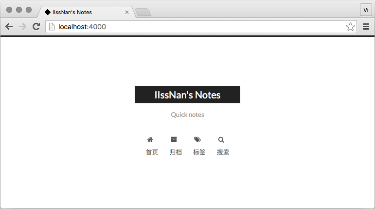

## 1.什么是 Hexo？

Hexo 是一个快速、简洁且高效的博客框架。Hexo 使用 [Markdown](http://daringfireball.net/projects/markdown/)（或其他渲染引擎）解析文章，在几秒内，即可利用靓丽的主题生成静态网页。


## 2.安装hexo

```
# 安装hexo
npm install hexo-cli g

# 初始化博客文件夹
hexo init blog

# 切换到该路径
cd blog

# 安装hexo的扩展插件
npm install

# 安装其它插件
npm install hexo-server --save
npm install hexo-admin --save
npm install hexo-generator-archive --save
npm install hexo-generator-feed --save
npm install hexo-generator-search --save
npm install hexo-generator-tag --save
npm install hexo-deployer-git --save
npm install hexo-generator-sitemap --save
```

## 3.建站过程

```
初始化（ <folder>表示文件夹名字）
hexo init <folder>

cd <folder>

安装依赖
npm install

```

目录结构如下

```
.
├── _config.yml
├── package.json
├── scaffolds
├── source
|   ├── _drafts
|   └── _posts
└── themes

```

### _config.yml

网站的 [配置](https://hexo.io/zh-cn/docs/configuration) 信息，您可以在此配置大部分的参数。

### package.json

应用程序的信息。[EJS](http://embeddedjs.com/), [Stylus](http://learnboost.github.io/stylus/) 和 [Markdown](http://daringfireball.net/projects/markdown/) renderer 已默认安装，您可以自由移除。

### scaffolds

[模版](https://hexo.io/zh-cn/docs/writing) 文件夹。当您新建文章时，Hexo 会根据 scaffold 来建立文件。

Hexo的模板是指在新建的markdown文件中默认填充的内容。例如，如果您修改scaffold/post.md中的Front-matter内容，那么每次新建一篇文章时都会包含这个修改。

### source

资源文件夹是存放用户资源的地方。除 `_posts` 文件夹之外，开头命名为 `_` (下划线)的文件 / 文件夹和隐藏的文件将会被忽略。Markdown 和 HTML 文件会被解析并放到 `public` 文件夹，而其他文件会被拷贝过去。

### themes

[主题](https://hexo.io/zh-cn/docs/themes) 文件夹。Hexo 会根据主题来生成静态页面。


下面以next主题为例介绍这么搭建个人博客

## 4.next主题使用教程

Hexo 安装主题的方式非常简单，只需要将主题文件拷贝至站点目录的 `themes` 目录下， 然后修改下配置文件即可。具体到 NexT 来说，安装步骤如下。 

~~~
在根目录下执行下面命令，将会在themes文件夹下下载next主题
git clone https://github.com/iissnan/hexo-theme-next themes/next

也可以直接下载主题包
前往 NexT 版本 发布页面https://github.com/iissnan/hexo-theme-next/releases，下载主题包放在themes文件夹下面，并将主题文件夹命名为next(任何名字都可以，主要为了和后面一致)
~~~

打开站点配置文件`_config.yml`中设置`theme: next `

### 4-1启动hexo

~~~
1.第一种方式：直接运行
hexo s

2.保险一点，先清除缓存再启动服务
hexo clean && hexo s
~~~

这时候会提示

~~~
INFO  Hexo is running at http://0.0.0.0:4000/. Press Ctrl+C to stop.
~~~

打开浏览器访问：`localhost:4000`即可看到启动页




## 5.发布

~~~
hexo d -g发布
~~~

