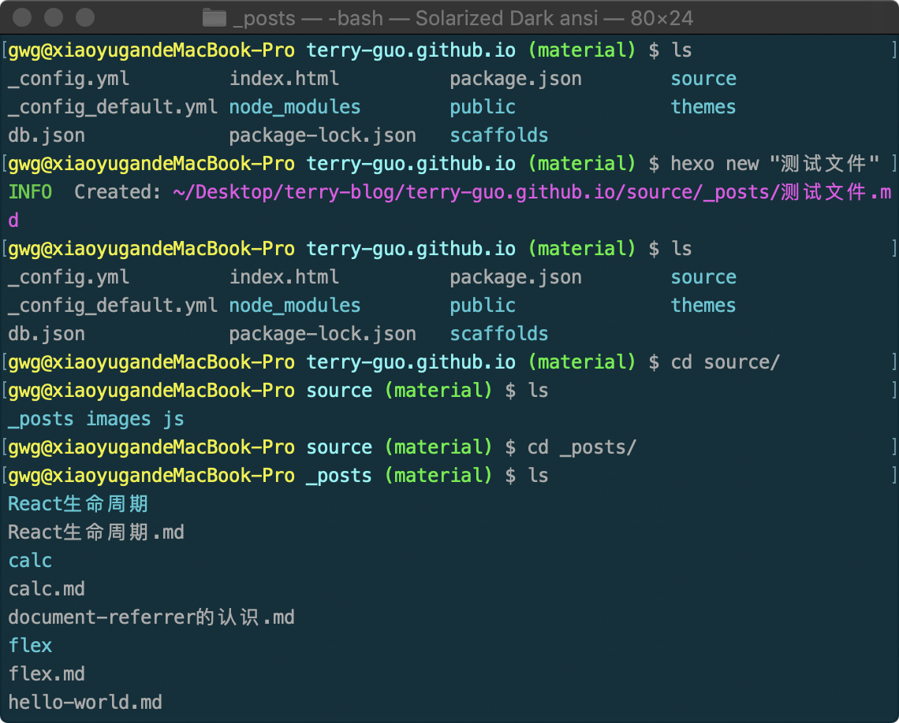

​	最近在使用Mac的过程中，发现系统自带的命令行工具不是很好看，而自带的一些主题也不够令我喜欢。于是开启了折腾之路

> 在用户主目录下建立一个配置文件（有文件会进入文件，没有会自动创建）

~~~
vi ~/.bash_profile
~~~

> 添加如下代码
>

~~~
#enables colorin the terminal bash shell export
export CLICOLOR=1

#setsup thecolor scheme for list export
export LSCOLORS=gxfxcxdxbxegedabagacad
 
#sets up theprompt color (currently a green similar to linux terminal)
#export PS1='\[\033[01;32m\]\u@\h\[\033[00m\]:\[\033[01;36m\]\w\[\033[00m\]\$'

#enables colorfor iTerm
export TERM=xterm-256color
[ -r ~/.bashrc ] && source ~/.bashrc
~~~

> 然后再创建一个配置文件（有文件会进入文件，没有会自动创建）

~~~
vi ~/.bashrc
~~~

> 添加如下代码

~~~

function git_branch {
  branch="`git branch 2>/dev/null | grep "^\*" | sed -e "s/^\*\ //"`"
  if [ "${branch}" != "" ];then
      if [ "${branch}" = "(no branch)" ];then
          branch="(`git rev-parse --short HEAD`...)"
      fi
      echo " ($branch)"
  fi
}

export PS1='\[\033[01;33m\]\u@\h \[\033[01;36m\]\W\[\033[01;32m\]$(git_branch)\[\033[00m\] \$ '

~~~

其中git_branch这个方法就是为了能够使命令行中显示git分支，PS1是这是命令行的字体颜色配置；

最终的效果就是这样（在这里用户名，git仓库名和分支名都是用的不同的颜色配置，为了方便区分，修改，删除和新增的文件也有不同的颜色）

## 1.补充

上述创建的文件可以在访达中打开查看。因为是隐藏文件，所以需要开启显示隐藏文件的设置才能查看，快捷键 `shift+command+.`

## 2.PS1变量详解

~~~
\d ：代表日期，格式为weekday month date
\H ：完整的主机名
\h ：主机的第一个名字
\t ：显示时间为24小时格式(HH:MM:SS)
\T ：显示时间为12小时格式
\A ：显示时间为24小时格式(HH:MM)
\u ：当前用户的账户名
\v ：BASH的版本信息
\w ：完整的工作目录名
\W ：利用basename取得工作目录名称，所以只会列出最后一个目录
\# ：第几个命令
\$ ：提示字符，如果是root时，提示符为：#;普通用户为：$
~~~

~~~
//颜色表
前景   背景   颜色
30     40    黑色
31     41    红色
32     42    绿色
33     43    黄色
34     44    蓝色
35     45    紫红色
36     46    青蓝色
37     47    白色

//其他
0            OFF
1            高亮显示
4            underline            
7            反白显示
8            不可见
~~~

以我的设置为例讲解

~~~
export PS1='\[\033[01;33m\]\u@\h \[\033[01;36m\]\W\[\033[01;32m\]$(git_branch)\[\033[00m\] \$ '
~~~

\033 声明了转义序列的开始，然后是 [ 开始定义颜色。[]前后都需要加转义字符 \

比如设置用户名的颜色 \[\033[01;33m\\] ==> 01表示高亮，33表示黄色，m表示打开前色；后面的颜色同理

。。。未完待续