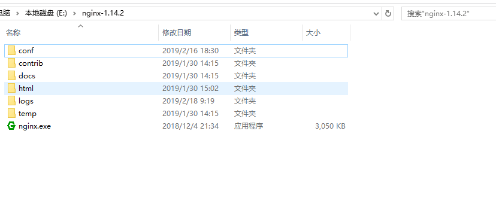

## 前端配置nginx实现跨域

> 前言：以前做过jsonp实现跨域，不过这种需要服务端配合。现在的前端项目，比如vue，react等，在配置项目的脚手架中就带有跨域设置，也可以自己写一个node服务来跨域，今天来简单学习一下用nginx来实现跨域。

 

## 1.什么是nginx

nginx是一个高性能的HTTP和反向代理[服务器](https://www.baidu.com/s?wd=%E6%9C%8D%E5%8A%A1%E5%99%A8&tn=24004469_oem_dg&rsv_dl=gh_pl_sl_csd)，也是一个IMAP/POP3/SMTP代理服务器。 nginx的作用是:反向代理，负载均衡。其特点是占有内存少，并发能力强。 


## 2.nginx安装

### 2-1 windows版：

> nginx下载地址：http://nginx.org/en/download.html 

nginx官网提供了三个类型的版本：

- Mainline version：Mainline 是 Nginx 目前主力在做的版本，可以说是开发版 .
- Stable version：最新稳定版，生产环境上建议使用的版本 
- Legacy versions：遗留的老版本的稳定版 

​      建议使用稳定版。下载之后解压，解压路径中尽量不要有中文，实际上各种环境配置，软件安装等目录尽量都不要用中文，因为中英文字符编码不一样。

解压之后的目录就是这样



windows中常用的操做命令，一下命令全在上面根目录进行，用系统自带命令行，比如cmd。

1.启动nginx。实际上点击nginx.exe也能打开nginx，但是不容易关闭，需要到任务管理器中找到相关服务强行停止掉，建议使用下面命令行开启服务。

~~~
start nginx
~~~

nginx默认使用80端口，如果电脑中有其他服务占用了80端口，修改nginx使用的端口即可。

~~~
server {
 listen  80;  // 这里改成其他的，比如8082
 server_name localhost;
}
~~~


2.重启nginx，修改nginx配置之后就需要重启一下

~~~
nginx -s reload
~~~

3.停止nginx。建议使用后面那种停止方式

~~~
 nginx -s stop
 nginx -s quit
~~~

nginx停止命令stop与quit参数的区别在于stop是快速停止nginx，可能并不保存相关信息，quit是完整有序的停止nginx，并保存相关信息。nginx启动与停止命令的效果都可以通过Windows任务管理器中的进程选项卡观察。


4.其他nginx命令（一般很少用到）

```
-?,-h           : 打开帮助信息
-v              : 显示版本信息并退出
-V              : 显示版本和配置选项信息，然后退出
-t              : 检测配置文件是否有语法错误，然后退出
-q              : 在检测配置文件期间屏蔽非错误信息
-s signal       : 给一个 nginx 主进程发送信号：stop（停止）, quit（退出）, reopen（重启）, reload（重新加载配置文件）
-p prefix       : 设置前缀路径（默认是：/usr/local/Cellar/nginx/1.2.6/）
-c filename     : 设置配置文件（默认是：/usr/local/etc/nginx/nginx.conf）
-g directives   : 设置配置文件外的全局指令
```

### 2-2 mac版


1.打开终端，安装Command Line tools ，基本上应该都安装过这个，可以跳过

~~~

xcode-select --install
~~~

2.安装brew命令 

~~~
ruby -e "$(curl -fsSL https://raw.githubusercontent.com/Homebrew/install/master/install)"
~~~

3.安装nginx 

~~~
brew install nginx
~~~

4.启动nginx

~~~
sudo nginx
~~~

5.mac版nginx命令，基本上和windows差不多

~~~
sudo nginx   // 启动
sudo -s reload  // 重启
sudo -s quit  // 停止
sudo -s stop   // 停止
~~~

6.nginx安装目录

~~~
open /usr/local/etc/nginx/
~~~


## 3.nginx配置

nginx启动之后，访问`http://localhost:8082/`，因为我修改了nginx的默认端口为`8082`。


### 3-1 配置详解

我们先看一下nginx的默认配置，在conf文件夹中，找到nginx.conf文件。在我这路径为`E:\nginx-1.14.2\conf\nginx.conf`

~~~

#user  nobody;
worker_processes  1;

#error_log  logs/error.log;
#error_log  logs/error.log  notice;
#error_log  logs/error.log  info;

#pid        logs/nginx.pid;


events {
    worker_connections  1024;
}


http {
    include       mime.types;
    default_type  application/octet-stream;

    #log_format  main  '$remote_addr - $remote_user [$time_local] "$request" '
    #                  '$status $body_bytes_sent "$http_referer" '
    #                  '"$http_user_agent" "$http_x_forwarded_for"';

    #access_log  logs/access.log  main;

    sendfile        on;
    #tcp_nopush     on;

    #keepalive_timeout  0;
    keepalive_timeout  65;

    #gzip  on;

    server {
        listen       80;
        server_name  localhost;

        #charset koi8-r;

        #access_log  logs/host.access.log  main;

        location / {
            root   html;
            index  index.html index.htm;
        }

        #error_page  404              /404.html;

        # redirect server error pages to the static page /50x.html
        #
        error_page   500 502 503 504  /50x.html;
        location = /50x.html {
            root   html;
        }

        # proxy the PHP scripts to Apache listening on 127.0.0.1:80
        #
        #location ~ \.php$ {
        #    proxy_pass   http://127.0.0.1;
        #}

        # pass the PHP scripts to FastCGI server listening on 127.0.0.1:9000
        #
        #location ~ \.php$ {
        #    root           html;
        #    fastcgi_pass   127.0.0.1:9000;
        #    fastcgi_index  index.php;
        #    fastcgi_param  SCRIPT_FILENAME  /scripts$fastcgi_script_name;
        #    include        fastcgi_params;
        #}

        # deny access to .htaccess files, if Apache's document root
        # concurs with nginx's one
        #
        #location ~ /\.ht {
        #    deny  all;
        #}
    }


    # another virtual host using mix of IP-, name-, and port-based configuration
    #
    #server {
    #    listen       8000;
    #    listen       somename:8080;
    #    server_name  somename  alias  another.alias;

    #    location / {
    #        root   html;
    #        index  index.html index.htm;
    #    }
    #}


    # HTTPS server
    #
    #server {
    #    listen       443 ssl;
    #    server_name  localhost;

    #    ssl_certificate      cert.pem;
    #    ssl_certificate_key  cert.key;

    #    ssl_session_cache    shared:SSL:1m;
    #    ssl_session_timeout  5m;

    #    ssl_ciphers  HIGH:!aNULL:!MD5;
    #    ssl_prefer_server_ciphers  on;

    #    location / {
    #        root   html;
    #        index  index.html index.htm;
    #    }
    #}

}

~~~

上面文件，简单点说就是

~~~
main
	  events   {
		....
	  }
	  http        {
		....
		upstream myproject {
		  .....
		}
		server  {
		  ....
		  location {
			  ....
		  }
		}
		server  {
		  ....
		  location {
			  ....
		  }
	  }
	  ....

~~~

1.main(全局设置) 。主要控制nginx子进程的所属用户/用户组、派生子进程数、错误日志位置/级别、pid位置、子进程优先级、进程对应cpu、进程能够打开的文件描述符数目等。 

2.events(nginx工作模式) 。控制nginx处理连接的方式 

3.http(http设置) 。是nginx处理http请求的主要配置模块，大多数配置都在这里面进行。 

4.sever(主机设置) 。是nginx中主机的配置块，可以配置多个虚拟主机。

5.location(URL匹配) 。是server中对应的目录级别的控制块，可以有多个。 

6.upstream(负载均衡服务器设置) 。是nginx做反向代理和负载均衡的配置块，可以有多个。 


### 3-1实战练习

下面我们用豆瓣api V2开放接口来做实验。

> 接口地址：http://api.douban.com/v2/movie/top250?start=25&count=25 

axios请求：

~~~
axios.get({
	method:'get',
    url:"/v2/movie/top250?start=25&count=25"
}).then((res)=>{
    console.log(res.data)
})

~~~

或者使用jquery

~~~
$.get("/v2/movie/top250?start=25&count=25", function(data){
    console.log(data);
})
~~~


要实现跨域，只需要简单修改几个设置。

1.修改默认配置，大概在35行，80端口改为8082，当然，其他数字也可以，只要是未被占用的端口

```
 listen       80;
```

2.反向代理到webpack-server服务 
默认代理服务为

```
 location / {
            root   html;
            add_header Cache-Control no-store;
            add_header 'Access-Control-Allow-Origin' '*';
            index  index.html index.htm;
        }
```

修改为下面这样，建议注释掉上面部分，新增下面这部分内容。

```
     location / {
             # 反向代理到webpack-server服务
             proxy_pass http://127.0.0.1:8081;
        }
```


这个匹配规则是，匹配到路由中有`/`的部分就代理到`http://127.0.0.1:8081`，相当于全局匹配。。

然后我们在nginx配置文件中，新增一条配置

~~~
  server {
      location ^~ /v2/movie {
                proxy_pass http://api.douban.com;
            }
        }
~~~

这里个规则是匹配到 `/v2/movie `路由之后，重定向到`http://api.douban.com`

这里需要注意一点，proxy_pass这里，`http://api.douban.com`和`http://api.douban.com/`是不一样的。

- 不加`/`的情况，访问`http://10.1.70.229:8082/v2/movie/v2/movie/top250?start=25&count=25`会得到`http://api.douban.com/v2/movie/top250?start=25&count=25 `（符合预期的）
- 加/的情况,访问`http://10.1.70.229:8082/v2/movie/v2/movie/top250?start=25&count=25`会得到``http://api.douban.com/top250?start=25&count=25 ``（不符合预期）

下面两种配置效果是一样的。

~~~
location ^~ /v2/movie {
                proxy_pass http://api.douban.com;
            }
~~~

或

~~~
   location ^~ /v2/movie {
            proxy_pass http://api.douban.com/v2/movie/;
        }
~~~

针对这种情况，如果后端接口统一有了规定前缀，比如**/api**，那你这里就不要配置斜杠了。另一种情况，后端接口shit一样，没有统一前缀，这边又要区分，那就在前端所有接口都加一个统一前缀，比如**/api**，然后通过加**斜杠**来替换掉好了～ 


删掉多余注释代码，整个nginx.conf文件配置如下。

~~~


worker_processes  1;

events {
    worker_connections  1024;
}

http {
    include       mime.types;

    default_type  application/octet-stream;

    sendfile        on;

    keepalive_timeout  65;

    server {
        listen       8082;
        server_name  gwg.localhost;
        
        location / {
             # 反向代理到webpack-server服务
             proxy_pass http://127.0.0.1:8081;
        }

        # 匹配豆瓣api
        location ^~ /v2/movie {
            # rewrite ^/v2/movie/(.*)$ /$1 break;
            proxy_pass http://api.douban.com;
        }

        # 匹配到错误之后的处理页
        error_page   500 502 503 504  /50x.html;
        location = /50x.html {
            root   html;
        }

    }

}

~~~


### 3-3 rewrite 

rewrite功能就是，使用nginx提供的全局变量或自己设置的变量，结合正则表达式和标志位实现url重写以及重定向。rewrite只能放在server{},location{},if{}中，并且只能对域名后边的除去传递的参数外的字符串起作用，例如 `http://seanlook.com/a/we/index.php?id=1&u=str` 只对/a/we/index.php重写。语法`rewrite regex replacement [flag];`

如果相对域名或参数字符串起作用，可以使用全局变量匹配，也可以使用proxy_pass反向代理。

表明看rewrite和location功能有点像，都能实现跳转，主要区别在于rewrite是在同一域名内更改获取资源的路径，而location是对一类路径做控制访问或反向代理，可以proxy_pass到其他机器。很多情况下rewrite也会写在location里，它们的执行顺序是：

1. 执行server块的rewrite指令
2. 执行location匹配
3. 执行选定的location中的rewrite指令

如果其中某步URI被重写，则重新循环执行1-3，直到找到真实存在的文件；循环超过10次，则返回500 Internal Server Error错误。


还是使用豆瓣的接口

> 接口地址：http://api.douban.com/v2/movie/top250?start=25&count=25 


在js中这样访问，注意多了 /api 部分

~~~
$.get("/api/v2/movie/top250?start=25&count=25", function(data){
    console.log(data);
})
~~~


配置中的location修改为

~~~
 location ^~ /api/ {
            rewrite ^/api/(.*)$ /$1 break;
            proxy_pass http://api.douban.com/;
        }
~~~

这里解释为：匹配到请求路径中包含 `/api/`部分时候，将`/api/`这部分替换为`http://api.douban.com/`

也就是说请求的是`http://10.1.70.229:8082/api/v2/movie/top250?start=25&count=25`，实际上已经代理到`http://api.douban.com/api/v2/movie/top250?start=25&count=25`，得到了接口的数据


### 3-4 location

> 自出引用自  https://segmentfault.com/a/1190000002797606#articleHeader0


语法规则： location [=|~|~*|^~] /uri/ { … }

= 开头表示精确匹配

^~ 开头表示uri以某个常规字符串开头，理解为匹配 url路径即可。nginx不对url做编码，因此请求为/static/20%/aa，可以被规则^~ /static/ /aa匹配到（注意是空格）。

~ 开头表示区分大小写的正则匹配

~*  开头表示不区分大小写的正则匹配

!~和!~*分别为区分大小写不匹配及不区分大小写不匹配 的正则

/ 通用匹配，任何请求都会匹配到。

多个location配置的情况下匹配顺序为（参考资料而来，还未实际验证，试试就知道了，不必拘泥，仅供参考）：

首先匹配 =，其次匹配^~, 其次是按文件中顺序的正则匹配，最后是交给 / 通用匹配。当有匹配成功时候，停止匹配，按当前匹配规则处理请求。

```
location = / {  
   #规则A  
}  
location = /login {  
   #规则B  
}  
location ^~ /static/ {  
   #规则C  
}  
location ~ \.(gif|jpg|png|js|css)$ {  
   #规则D  
}  
location ~* \.png$ {  
   #规则E  
}  
location !~ \.xhtml$ {  
   #规则F  
}  
location !~* \.xhtml$ {  
   #规则G  
}  
location / {  
   #规则H  
} 
```


那么产生的效果如下：

访问根目录/， 比如http://localhost/ 将匹配规则A

访问 http://localhost/login 将匹配规则B，http://localhost/register 则匹配规则H

访问 http://localhost/static/a.html 将匹配规则C

访问 http://localhost/a.gif, http://localhost/b.jpg 将匹配规则D和规则E，但是规则D顺序优先，规则E不起作用，而 http://localhost/static/c.png 则优先匹配到 规则C

访问 http://localhost/a.PNG 则匹配规则E， 而不会匹配规则D，因为规则E不区分大小写。

访问 http://localhost/a.xhtml 不会匹配规则F和规则G，http://localhost/a.XHTML不会匹配规则G，因为不区分大小写。规则F，规则G属于排除法，符合匹配规则但是不会匹配到，所以想想看实际应用中哪里会用到。

访问 http://localhost/category/id/1111 则最终匹配到规则H，因为以上规则都不匹配，这个时候应该是nginx转发请求给后端应用服务器，比如FastCGI（php），tomcat（jsp），nginx作为方向代理服务器存在。


暂时就了解到这里了，后续有机会再次学习.......


