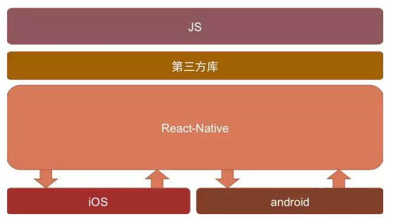
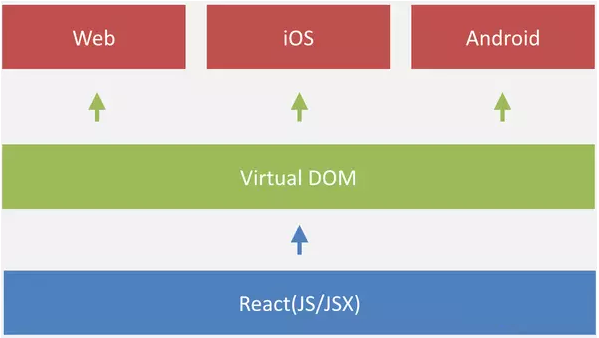

# 1.ReactNative基础

## 1.RN的介绍

****

尽管在移动开发中，原生App的开发成本很高，但现阶段基于原生开发仍然是必须的，因为Web的用户体验仍无法超越Native，主要体现在：

- Native的原生控件有更好的体验；
- Native有更好的手势识别；
- Native有更合适的线程模型，尽管Web Worker可以解决一部分问题，但如图像解码、文本渲染仍无法多线程渲染，这影响了Web的流畅性。

> **思考？**
>
> 怎么做才能拥有Native的体验和性能，又能够高效率开发、跨平台开发？

**一、答案**

      React Native于F8大会开源,在短短不到一年的时间里,它成为手机端必不可少的开发模式之一。 它充分利用了Facebook现有的业务轮子, 其核心设计理念：**既拥有Native的用户体验、又保留React的开发效率**。`(  React : 1.有一个虚拟dom ; 2.基于组件 ; 3.状态机  )`

      目前，React Native基本完成了对多端的支持，实现了真正意义上的面向配置开发: 开发者可以灵活的使用HTML和CSS布局,使用React语法构建组件,实现：**Android, iOS 两端代码的复用**。

****

       此外，使用流畅度和原生的保持在同一层次,这不是我们梦寐以求的开发模式吗?让我们从无到有开启新的学习篇章吧!

**二、什么是React Native？**

**（一）时下移动互联网主流技术**

           BAT等一线互联网公司的插件化，热修改等技术

           阿里的Weex、尤雨溪的Vue.js等

           React 与 React Native技术

**（二）React Native介绍**

          Facebook于2015年9月15日发布**React Native;**

          广大开发者可以使用JavaScript和React开发跨平台移动应用;

          React Native特点：

          1）使用 **Virtual DOM**；

​		1)通过JS对象模拟原生DOM，加上DOM Diff 极大提升了**DOM操作的性能**

 		2)浏览器中，Virtual DOM最终编译成了DOM ; 但是在 iOS中，Virtual DOM却完全可以编译成                     		 

​		  oc的组件，甚至在安卓、windows、mac osx 中都完全**可以编译成对应的UI组件**

          2）提供了**响应式**（Reactive）和**组件化**（Composable）的视图组件；

​		例如：响应式开发的页面会根据用户行为以及设备环境(系统平台、屏幕尺寸、屏幕定向等)进行	

​                           相应的响应和调整 ,  响应式的页面有能力去自动响应用户的设备环境。

​		例如：每一个组件都有自己清晰的职责，完整的功能，较低的耦合便于单元测试和重复利用；

​			   低耦合性，通俗点说，代码独立不会和项目中的其他代码发生冲突等。

          3）将注意力集中保持在核心库，伴随于此，有配套的**路由**和负责处理**全局状态管理**的库。

 （**三）React Native的优势**

      1）跨平台开发

        运用React Native，我们可以使用同一份业务逻辑核心代码来创建原生应用运行在Web端，Android端和iOS端；

     2）追求极致的用户体验：实时热部署  

   3）learn once ,  write everywhere （最具魅力）

        React Native不强求一份原生代码支持多个平台，所以不是“Write once, run anywhere”（Java），而是“Learn once, write anywhere”。

        

**（四）React Native开发注意事项**

      1）目前react native在iOS上仅支持**ios7**以上，Android仅支持**Android4.1**以上版本；

       github地址:  https://github.com/facebook/react-native 

       官网文档: http://facebook.github.io/react-native/docs/getting-started.html

      2 )由于React Native的版本更新速度很快( bug ,不稳定 )，如果没有深厚的JavaScript基础，建议：

          **a、功能适中，交互一般，不需要特别多的系统原生支持；**

​	  **b、对于部分复杂的应用，可以考虑原生+React Native混合开发**


## *2.ReactNative开发环境搭建

ReactNative 开发环境搭建：http://reactnative.cn/docs/0.48/getting-started.html

ReactNative 视频教程：https://ke.qq.com/course/197101

### 1.[安装jdk1.8](http://www.oracle.com/technetwork/java/javase/downloads/jdk8-downloads-2133151.html)

参考：https://jingyan.baidu.com/article/6dad5075d1dc40a123e36ea3.html

### 2.[*安装android studio](https://developer.android.com/studio/index.html)

打开Android SDK Manager。

选中以下项目，以下的是必需安装：

- Android SDK Build-tools version 23.0.1
- Android Support Repository
- Android 6.0 (API 23)

### 3.[配置sdk路径]()

- 添加环境变量ANDROID_HOME ：android sdk根路径
- 修改path路径:%ANDROID_HOME%\tools;%ANDROID_HOME%\platform-tools


**以上1-3步骤是搭建android开发环境**, 因为ReactNative的开发环境是依赖Android开发环境

### 


### 4.[安装Python2](https://www.python.org/downloads/)

将python加入环境变量，然后可以通过 `python` 的命令来测试python是否安装成功

参考：https://jingyan.baidu.com/article/c910274be14d64cd361d2dd8.html

### 5.[安装node](https://nodejs.org/en/download/)

```
ReactNative是基于js的，Node.js轻量级的Web服务器，想要是React Native跑起来需要安装node， 如果没有安装node.js，先去官网安装node.js,最好是4.1以上版本

可以通过node -v的命令来测试NodeJS是否安装成功

//安装完node后建议设置npm镜像以加速后面的过程（或使用科学上网工具）。
npm config set registry https://registry.npm.taobao.org --global
npm config set disturl https://npm.taobao.org/dist --global
```

### 6.[安装git(可选)](https://git-scm.com/download/win)

```
安装React-native可能需要用到Git，如果没有配置git，需要先下载对应的客户端，
然后将git加入path环境变量
```

### 7.安装yarn 和 react-native命令行工具[react-native-cli]()

第一种(推荐)：

```
npm install -g yarn react-native-cli

//安装完yarn后同理也要设置镜像源：
yarn config set registry https://registry.npm.taobao.org --global
yarn config set disturl https://npm.taobao.org/dist --global
```

> 注意 : 
>
> 1.如果yarn安装成功, 但是yarn 命令使用不了,这时应该配置yarn 工具的环境变量.  yran工具默认的安装路径是: C:\dev\nvm\npm\node_modules\yarn\bin
>
> 2.如果react-native-cli 安装成功, 但是react-native-cli 命令使用不了,这时应该配置react-native-cli 工具的环境变量.  react-native-cli 工具默认的安装路径是:C:\dev\nvm\npm

参考：http://blog.csdn.net/u012987546/article/details/52210530


