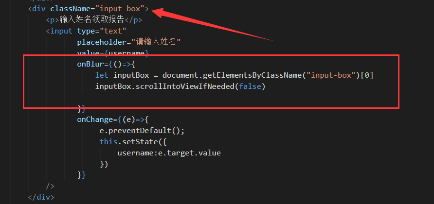

最近在开发中频繁遇到各种问题，针对这些问题花了一些时间来处理，于是记录下来，方便以后查阅。

## 1.canvas相关

### 1-1、canvas中涉及到图片的绘制

​	现在有一个业务需求是用canvas来实现，canvas画布里面有网络图片有其他元素有动画之类的，在最后的时候我需要将整个区域截图下来上传到服务器，用的包是html2canvas。 但是这里有个奇怪的问题：跨域。。图片链接测试的时候用的是前端图床里面，本身已经支持跨域的，在普通img标签里面加载整个图片，然后用html2canvas绘制成base64格式图是没问题的，但是这种图片用在canvas里面后，想要将整个canvas绘制成图片，还是依然受跨域问题的影响，截图空白 。

~~~
img.setAttribute('crossorigin', 'anonymous'); //允许图片跨域

let canvas = document.createElement('canvas'),
    ctx = canvas.getContext('2d');
let img = new Image();
    img.src = imgurl;
    img.setAttribute('crossorigin', 'anonymous'); // 注意设置图片跨域应该在图片加载之前
    img.onload = function () {
        ctx.drawImage(img, 0, 0, 200, 200);
}

~~~

### 1-2、部分ios10，及<=ios9的设备中，不兼容上述写法。

​	在canvas绘制图片的时候，一般需要先判断图片加载完了，所以会用到img的onload事件，一般的做法是下面这种。上述drawImage方法是处理具体的逻辑，但是这种写法在部分设备中不兼容。于是改成了下面这种

​	先放入一个空的img标签,id='newImg'，设置为用户不可见，在获取到这个dom元素之后，先监听onload事件，然后再给src赋值，这样才会兼容

~~~
let $newImg = document.getElementById("newImg");

$newImg.setAttribute('crossorigin', 'anonymous'); 
$newImg.onload = function(){ // 图片加载完之后进行操作
  _this.detailCanvas($newImg,sxData.hand);
}
$newImg.src = sxData.handUrl;
~~~

## 2、iOS9及以下设备不兼容forEach？

暂时不清楚这个bug还是什么情况，但确实在ios9的设备中没有执行forEach里面的逻辑

原来是这样：（AllLine是数组）

~~~
AllLine.forEach((vDom,k) => {
      vDom.style.width = '0%';
      let imgDom = document.getElementById(`icon${k+1}`);
      imgDom.src = loading;
      imgDom.className = "loadingImg"
})
~~~

后面改成这样才正常

~~~
 for (let i = 0; i < AllLine.length; i++) {
    let vDom = AllLine[i];
    vDom.style.width = '0%';
    let imgDom = document.getElementById(`icon${i+1}`);
    imgDom.src = loading;
    imgDom.className = "loadingImg"
}

~~~

## 3、在新版ios的微信中，点击input输入框问题

​	在新版ios的微信中，点击input输入框会顶起页面，这是正常的，但是输入完毕之后，原来软键盘区域会有一片空白，这样有点影响体验，后面看到别的小伙伴的解决方案。scrollIntoViewIfNeeded ，摸索了一下使用方法。

​	首先简单介绍一下scrollIntoViewIfNeeded 。

​	根据 [MDN](https://link.juejin.im?target=https%3A%2F%2Fdeveloper.mozilla.org%2Fzh-CN%2Fdocs%2FWeb%2FAPI%2FElement%2FscrollIntoView)的描述，`Element.scrollIntoView()`方法让当前的元素滚动到浏览器窗口的可视区域内。而`Element.scrollIntoViewIfNeeded（）`方法也是用来将不在浏览器窗口的可见区域内的元素滚动到浏览器窗口的可见区域。但如果该元素已经在浏览器窗口的可见区域内，则不会发生滚动。此方法是标准的Element.scrollIntoView()方法的专有变体。

​	 兼容性方面，`IE`和`FireFox`全红，如果`PC`端想用的话，基本只能内部项目了，略为可惜。但移动端还是绿悠悠的，基本都OK，可以安心使用~

​	`scrollIntoViewIfNeeded`是比较懒散的，如果元素在可视区域，那么调用它的时候，页面是不会发生滚动的。其次是`scrollIntoViewIfNeeded`只有`Boolean`型参数，也就是说，都是瞬间滚动，没有动画的可能了。

`scrollIntoViewIfNeeded`可以接受一个`Boolean`型参数，和`scrollIntoView`不同，`true`为默认值，但不是滚动到顶部，而是让元素在可视区域中居中对齐；`false`时元素可能顶部或底部对齐，视乎元素靠哪边更近。

​	下面是我的用法，失去焦点的时候让整个输入框部分与底部对其，因为在我这里，底部就是这个输入框了

## 4.定位问题

1.position:absolute

绝对定位的兼容性

 

 

 

 

 

 

 

